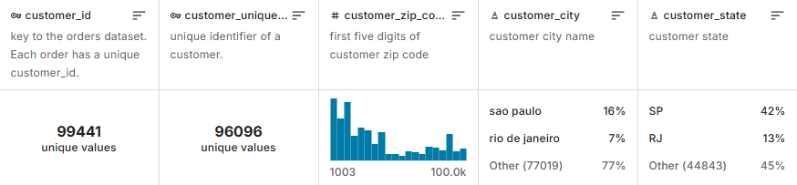

# Brazilian E-Commerce Dataset Documentation

## 📊 Overview

This project utilizes the **Brazilian E-Commerce Public Dataset by Olist**, which contains real commercial data from the Brazilian marketplace. The dataset spans orders made at Olist Store from 2016 to 2018 across multiple marketplaces in Brazil.

**Source**: [Kaggle - Brazilian E-Commerce Public Dataset by Olist](https://www.kaggle.com/datasets/olistbr/brazilian-ecommerce)

## 🗂️ Dataset Schema

The dataset consists of 8 interconnected CSV files representing different aspects of e-commerce operations:

### Entity Relationship Diagram

### Data Relationships

The central entity is **`olist_orders_dataset`**, which connects to all other datasets through various foreign keys:

- Orders → Customers (via `customer_id`)
- Orders → Order Items (via `order_id`)
- Orders → Order Payments (via `order_id`)
- Orders → Order Reviews (via `order_id`)
- Order Items → Products (via `product_id`)
- Order Items → Sellers (via `seller_id`)
- Customers → Geolocation (via `zip_code_prefix`)
- Sellers → Geolocation (via `zip_code_prefix`)

## 📁 Dataset Files

### 1. **olist_customers_dataset.csv**

Customer information and location data.

| Column | Type | Description |
|--------|------|-------------|
| `customer_id` | String | Key to the orders dataset. Each order has a unique customer_id |
| `customer_unique_id` | String | Unique identifier of a customer (for tracking repeat customers) |
| `customer_zip_code_prefix` | Integer | First five digits of customer zip code |
| `customer_city` | String | Customer city name |
| `customer_state` | String | Customer state |

**Key Statistics:**
- **99,441** unique values in `customer_id`
- **96,096** unique values in `customer_unique_id`
- **Top Cities**: São Paulo (16%), Rio de Janeiro (7%)
- **Top States**: SP (42%), RJ (13%)

**Important Note**: The same customer will get different `customer_id` for different orders. Use `customer_unique_id` to identify customers that made repurchases at the store.

---

### 2. **olist_orders_dataset.csv**

Core dataset containing order information and status.

| Column | Type | Description |
|--------|------|-------------|
| `order_id` | String | Unique identifier of the order |
| `customer_id` | String | Key to the customer dataset |
| `order_status` | String | Reference to the order status (delivered, shipped, etc.) |
| `order_purchase_timestamp` | Datetime | Timestamp of purchase |
| `order_approved_at` | Datetime | Timestamp of payment approval |
| `order_delivered_carrier_date` | Datetime | Order posting timestamp |
| `order_delivered_customer_date` | Datetime | Actual order delivery date |
| `order_estimated_delivery_date` | Datetime | Estimated delivery date |

**Order Status Values:**
- `delivered` - Order successfully delivered
- `shipped` - Order dispatched to customer
- `canceled` - Order canceled
- `unavailable` - Product unavailable
- `invoiced` - Invoice issued
- `processing` - Payment processing
- `approved` - Payment approved

---

### 3. **olist_order_items_dataset.csv**

Items purchased within each order.

| Column | Type | Description |
|--------|------|-------------|
| `order_id` | String | Order unique identifier |
| `order_item_id` | Integer | Sequential number identifying items in the same order |
| `product_id` | String | Product unique identifier |
| `seller_id` | String | Seller unique identifier |
| `shipping_limit_date` | Datetime | Seller shipping limit date |
| `price` | Float | Item price |
| `freight_value` | Float | Item freight value |

**Note**: An order may have multiple items. Each item may be fulfilled by a distinct seller.

---

### 4. **olist_order_payments_dataset.csv**

Payment information for each order.

| Column | Type | Description |
|--------|------|-------------|
| `order_id` | String | Unique identifier of an order |
| `payment_sequential` | Integer | Sequential number for orders with multiple payment methods |
| `payment_type` | String | Method of payment chosen |
| `payment_installments` | Integer | Number of installments |
| `payment_value` | Float | Transaction value |

**Payment Types:**
- `credit_card` - Credit card payment
- `boleto` - Brazilian bank slip payment
- `voucher` - Voucher or gift card
- `debit_card` - Debit card payment

**Note**: Orders may be paid in multiple installments or split across multiple payment methods.

---

### 5. **olist_order_reviews_dataset.csv**

Customer reviews and ratings for orders.

| Column | Type | Description |
|--------|------|-------------|
| `review_id` | String | Unique review identifier |
| `order_id` | String | Unique order identifier |
| `review_score` | Integer | Rating given by customer (1 to 5) |
| `review_comment_title` | String | Review title in Portuguese |
| `review_comment_message` | String | Review message in Portuguese |
| `review_creation_date` | Datetime | Review creation timestamp |
| `review_answer_timestamp` | Datetime | Review answer timestamp |

**Review Scores:** 1 (worst) to 5 (best)

---

### 6. **olist_products_dataset.csv**

Product catalog information.

| Column | Type | Description |
|--------|------|-------------|
| `product_id` | String | Unique product identifier |
| `product_category_name` | String | Root category of product (Portuguese) |
| `product_name_length` | Integer | Number of characters in product name |
| `product_description_length` | Integer | Number of characters in product description |
| `product_photos_qty` | Integer | Number of product photos |
| `product_weight_g` | Integer | Product weight in grams |
| `product_length_cm` | Integer | Product length in centimeters |
| `product_height_cm` | Integer | Product height in centimeters |
| `product_width_cm` | Integer | Product width in centimeters |

---

### 7. **olist_sellers_dataset.csv**

Seller information registered in Olist.

| Column | Type | Description |
|--------|------|-------------|
| `seller_id` | String | Seller unique identifier |
| `seller_zip_code_prefix` | Integer | First 5 digits of seller zip code |
| `seller_city` | String | Seller city name |
| `seller_state` | String | Seller state |

---

### 8. **olist_geolocation_dataset.csv**

Brazilian zip codes and their geographical coordinates (latitude/longitude).

| Column | Type | Description |
|--------|------|-------------|
| `geolocation_zip_code_prefix` | Integer | First 5 digits of zip code |
| `geolocation_lat` | Float | Latitude |
| `geolocation_lng` | Float | Longitude |
| `geolocation_city` | String | City name |
| `geolocation_state` | String | State |

**Note**: This dataset is used to add geolocation information to customers and sellers datasets.

---

### 9. **product_category_name_translation.csv**

Translation of product category names from Portuguese to English.

| Column | Type | Description |
|--------|------|-------------|
| `product_category_name` | String | Category name in Portuguese |
| `product_category_name_english` | String | Category name in English |

---

## 📈 Dataset Statistics

### Volume Overview

- **Orders**: ~100,000 orders
- **Customers**: ~99,000 unique customers (~96,000 unique individuals)
- **Products**: Various product categories
- **Sellers**: Multiple sellers across Brazil
- **Time Period**: 2016-2018
- **Geographic Coverage**: All Brazilian states

### Top Markets

**Cities:**
- São Paulo: 16% of orders
- Rio de Janeiro: 7% of orders
- Other cities: 77%

**States:**
- SP (São Paulo): 42%
- RJ (Rio de Janeiro): 13%
- Other states: 45%

## 🔑 Key Relationships

1. **One Order → One Customer**: Each order is placed by exactly one customer
2. **One Order → Multiple Items**: Orders can contain multiple products
3. **One Order → Multiple Payments**: Orders can be split across payment methods
4. **One Order → One Review**: Each order can have one customer review
5. **One Item → One Product**: Each item references one product
6. **One Item → One Seller**: Each item is fulfilled by one seller
7. **Multiple Customers/Sellers → One Location**: Geographic data shared via zip code

## 💡 Data Quality Notes

### Customer IDs
- **Important**: `customer_id` is unique per order, NOT per customer
- Use `customer_unique_id` for customer-level analysis and repeat purchase identification
- This design allows tracking of customer purchase history

### Missing Values
- Some orders may not have reviews
- Optional fields like `review_comment_title` and `review_comment_message` may be null
- Delivery dates may be null for orders not yet delivered

### Language
- Product categories, review comments, and some text fields are in Portuguese
- Use the translation file for English category names

## 🎯 Use Cases

This dataset is ideal for:

- **Sales Analytics**: Revenue trends, product performance, seasonal patterns
- **Customer Segmentation**: RFM analysis, geographic distribution, behavior clustering
- **Logistics Analysis**: Delivery time optimization, freight cost analysis
- **Product Intelligence**: Category performance, pricing strategies
- **Seller Performance**: Sales by seller, geographic coverage
- **Payment Analysis**: Payment method preferences, installment patterns
- **Customer Satisfaction**: Review sentiment analysis, rating correlations

## 📚 References

- **Original Source**: [Kaggle - Brazilian E-Commerce Public Dataset](https://www.kaggle.com/datasets/olistbr/brazilian-ecommerce)
- **License**: Public dataset provided by Olist
- **Context**: Real commercial data anonymized for privacy

---

**Note**: This dataset is provided for educational and analytical purposes. All personal information has been anonymized to protect customer privacy.